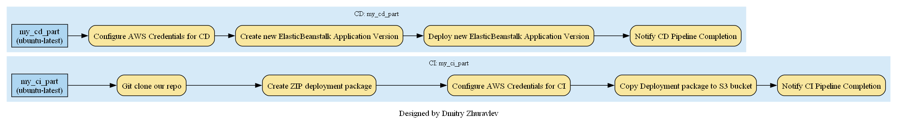
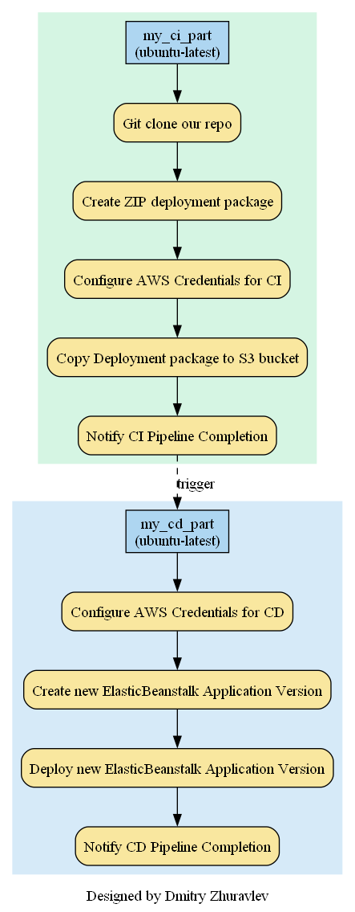

# CI/CD Pipeline to AWS Elastic Beanstalk for Python Flask Applications

## Technologies Used

    

## Overview

The main goal of this project is to demonstrate an effective CI/CD pipeline utilizing GitHub Actions for Python Flask applications. By incorporating GitHub Actions workflows, this project aims to automate the build, test, and deployment processes, minimizing manual intervention and enhancing overall deployment efficiency.

## Workflow Description

### Continuous Integration (CI) Part

#### Purpose:

The CI part involves:

- Cloning the repository using GitHub Actions.
- Packaging the Flask application into a deployment-ready ZIP file.
- Configuring AWS credentials for seamless integration with AWS services.
- Uploading the deployment package to the specified AWS S3 bucket.
- Notifying successful completion of the CI pipeline.

### Continuous Deployment (CD) Part

#### Purpose:

The CD part includes:

- Creating a new Elastic Beanstalk Application Version.
- Updating the environment in Elastic Beanstalk.
- Notifying successful completion of the CD pipeline.

## Usage

### Prerequisites:

To effectively use this CI/CD pipeline, ensure the following prerequisites are met:

1. **AWS IAM User:**
   - Create an AWS IAM User with:
     - AWS Access Key and AWS Secret Key.
     - Privileges: S3 Full Access and Elastic Beanstalk Full Access.

2. **AWS S3 Bucket:**
   - Set up an AWS S3 Bucket to store deployment packages.

3. **AWS Elastic Beanstalk:**
   - Prepare an existing Elastic Beanstalk Environment and Sample Application.

### Getting Started

To integrate this CI/CD pipeline with your Python Flask application:

1. **Configure AWS Credentials:**
   - Set up AWS credentials in your GitHub repository secrets.

2. **Modify Workflow:**
   - Customize the workflow to match your specific application requirements by updating environment variables and deployment targets as needed.

## Workflow Showcase

### Sample Workflows:

This repository includes sample workflows demonstrating basic actions like printing messages, listing files, cloning repositories, and job dependencies. These workflows aim to provide a comprehensive understanding of YAML syntax, job dependencies, environment variables, and software testing within GitHub Actions.

## High level diagram

## Detailed CI/CD Pipeline Diagram

The following diagrams illustrate the GitHub Actions workflows used in this project.  
Both diagrams were generated using Python scripts `generate_ci_cd_pipeline_diagram_v1.py` and `generate_ci_cd_pipeline_diagram_v2.py`.

### CI/CD Pipeline Diagram v1

#### CI/CD Pipeline Diagram v2

### CI/CD Pipeline Demonstration:

This project's CI/CD pipeline demonstrates the automated deployment of updates to the deployed web application. A recent change to the `help.html` file triggered the GitHub Actions workflow, resulting in the deployment of a new version (v1.1) of the `/help` web page.

#### Version Comparison:

Below is a visual comparison between the previous version (v1.0) and the newly deployed version (v1.1) of the `/help` web page:

The image showcases the changes made between the two versions. These alterations were seamlessly deployed using the CI/CD pipeline powered by GitHub Actions.

## Contribution

Contributions to this project are welcome! 

